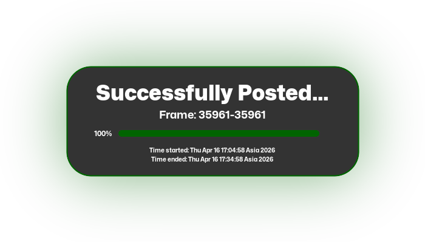

<h1 align="center">Every Roshidere Frame in Order BOT</h1>

<div align="center">

`An OpenSource BOT for Facebook Frame in Order`<br>
`that runs without 24/7 hosting costs`

</div>


## Contributing
<div align="center">

```diff
+ All PR's are now welcome!! +
```
If you have ideas or fixes to the bugs and also improving the codes, Feel free to [Contribute](./CONTRIBUTING.md)! 😉
</div>

## Status

